**Total time spent on project: 26.5h**

## June 4th: Start!

After some thinking for almost an hour, I decided to make my own timer/stopwatch thing. Calling it "Clook" because it sounds similar to "clock", but in a fun and unique way. 

Whipped out an online painting tool to flesh out my intial idea. Features I want to have are:
- USB C charging
- LED ring to show timer status and display things
- Screen to show exact time left (maybe touch screen?)
- Physical buttons to also interact with the device

You can see my very rough rendering below.

**Total time spent: 1.5h**

## June 7th: Finding the Display

Today was spent primarily trying to figure out what display I would use for the project. After thoroughly checking DigiKey, Mouser, and LCSC for a small circular OLED display, I decided (tentatively) to just use [this](https://www.alibaba.com/product-detail/1-5-Inch-466-466-16_1601271796179.html) display from Alibaba. Because it was from Alibaba, and the product description had no datasheet whatsoever, I had to track it down from the vendor website. Eventually though, I was able to make a symbol for the display in KiCad.

The one thing that is scaring me though is the shipping time. If I were to order right now, the screen would come earliest July 11th...

Don't know yet though if that will be a dealbreaker. Another display that I might pivot to is an [LCD](https://www.mouser.com/ProductDetail/Microtips-Technology/AWD-360360T18N01?qs=sGAEpiMZZMt7dcPGmvnkBgpwamjCGwcHVYYbZzFyeqeK65tjxJno9g%3D%3D) from Mouser, simply because it's around the same price with shipping, and it can come significantly quicker. Its datasheet is also easier to understand and simpler overall.

**Total time spent: 2h**

## June 11th: Part Hunting and CADding

Did a lot today. My main focus was on trying to get a rough idea of the footprint of the entire device, and to start to look for parts that can feasibly fit the footprint (mainly the battery).

*Side note: I decided after all to abandon the Alibaba OLED display from the last journal entry in favor of the LCD mainly because of shipping. So much for that KiCad schematic..*

After scouring the Internet, and modifying my CAD design, I decided to use this [LiPo Battery](https://www.amazon.com/AKZYTUE-Battery-Rechargeable-Lithium-Connector/dp/B07TS8LTH7) that I found on Amazon to power the project. It has a modest 710 mAh capacity, which should hopefully be enough to power this device for maybe several hours, and last some battery charging cycles.

Another thing that I researched today was including an ambient light sensor to figure out if the display needs to be on fully or if it can be dimmed a lot. My plan right now is to include it somewhere on the front, but we shall see if that is possible once I begin making the PCB.

Last thing - I also came up with a better looking UI that will be a decal in CAD for the LCD in Figma. You can see it on the rough CAD assembly I made today below.

(I kept working after writing that entry)

Was too tired to finish that journal entry for Jun. 11th, but I worked a little bit more after the CAD session on trying to find a footprint for the LCD screen. It required a Hirose FH33-12S-0.5SH connector, but I could not find the footprint on the Hirose website, on KiCad, and even on Mouser. It wasn't until I went to DigiKey under some tab on the product page that I found it.

Hopefully that actually works, if not I might be screwed.

**Total time spent: 3h**

## June 12th: Schematic Start

Woke up this morning to an email from Mouser. My CAD request for the LCD screen that I made earlier had gone through, so now the 30 minutes that I spent yesterday on the LCD screen CAD, trying to find the right dimensions from the datasheet, is (basically) irrelevant now. You can see how close I did get though in the picture below:

Also started working on my schematic for the project (see below). This required *a lot* of research. To show how much, here's all the things that I learned about today:

- SPI vs I2C communication for LCD (and which one my screen used)
- Voltage regulators (linear vs switching)
- USB C specifications and standard
- Bluetooth vs BLE
- nRF52840 chip (which has BLE)

Going off of that last bullet point, I have also tentatively decided to use the Seeed Studio XIAO nRF52840 to run the whole project. Still researching about voltage regulators and how they work (trying to learn if I should go fixed or adjustable).

Overall productive day.

**Total time spent: 3h**

## June 13th: Decoupling Capacitors

Shorter day today, primarily because I finished up all the loose ends from voltage regulators that I dove into yesterday. Did some poking around online to learn about decoupling or bypass capacitors, and I realized that I probably should have some in my schematic (so I added them). All of the voltages for the LCD screen in the schematic should (fingers crossed) be good now.

Additionally, I also started to do some more research on the XIAO nRF52840 and its capabilities, and I think I might have to pivot away from it due to it supporting only one SPI interface. Its beefier brother, the XIAO nRF52840 Sense Plus, is looking like a better option now because of the 2 SPI interfaces that it provides.

The reason why I think I want to provide another SPI interface is oriented around what I want this device to do. After thinking for a week, I've decided to go all in on the idea of "a stopwatch that remembers". So sometime soon I'm going to try to add a MicroSD card slot so there is a way to "remember" what was tracked and when.

Here's what the schematic looked like after today's work:

**Total time spent: 1.5h**

## June 14th: Small things

Didn't get to do as much today (weekend), but I still got some minor stuff done.

First off, I decided that I wanted to make this stopwatch resemble more of a mechanical stopwatch (example [here](https://www.marathonwatch.com/collections/mechanical-stopwatches/products/6-second-stopwatch-calibrated-yards)). So, I played around with the CAD and dimensions, and also looked for really tiny rotary encoders. It seems like I might have to make the watch thicker to account for rotary encoder on the "crown" of the stopwatch (most were at least 10mmx10mm), so we'll see how far I get with that.

Other things:

I redesigned the stopwatch face to look like this:

*fyi it's all white so ignore the fact that you can't see the border*

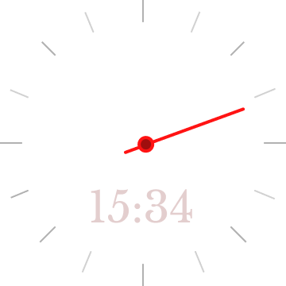

I also made a prototype crown that I could maybe attach to a 6mm rotary encoder.

**Total time spent: 0.5h**

## June 15th: Screw all of that

If there was ever a "Come to Jesus moment" for the project, today definitely is it. In order to set the stage, I spent a little bit of time on and off working on the project today. I tried to fit a rotary encoder on the top of Clook, but it ended up looking like this:

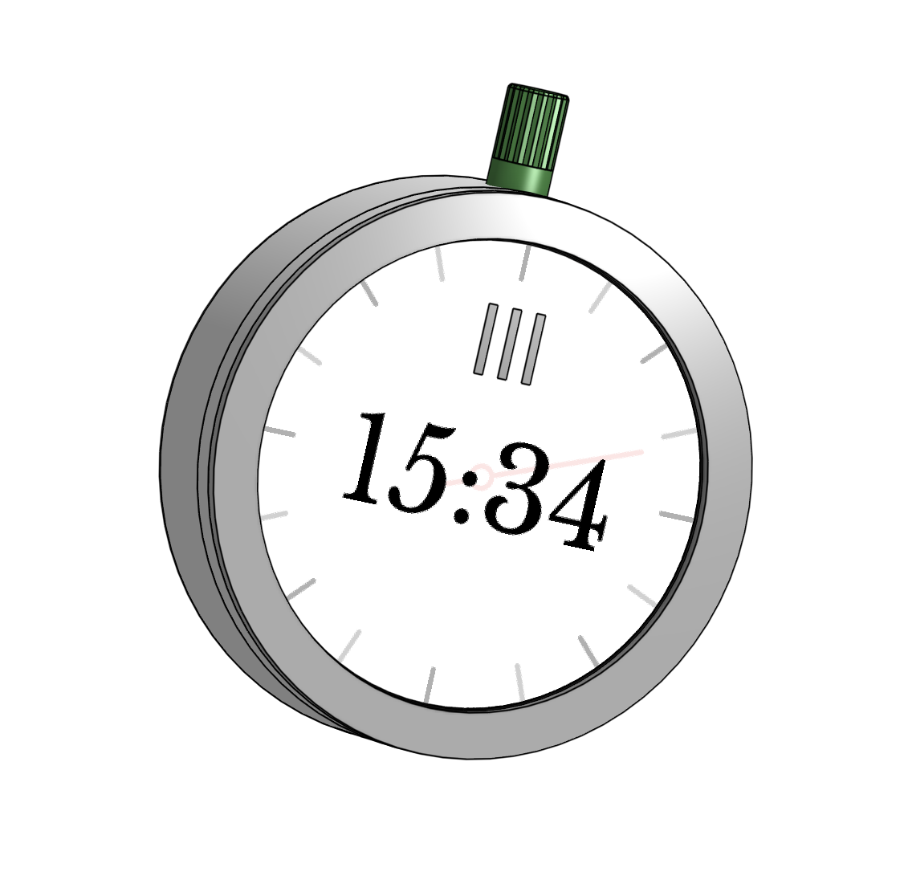

Not good. What's also not good is that most rotary encoders are around that thickness, if not thicker. This means that Clook would end up having to be some ridculous thickness like 22mm or somewhere around that for this whole thing to world. And don't even get me started on how I would mount the encoder, let alone connect it to the PCB.

All of this led to one question - *Why?* Why did I have to make this look this way? Why do I have to make a thick, plastic, mechanical looking stopwatch?

I pondered this while I showered. Then, after looking at clocks like [this](https://us.braun-clocks.com/cdn/shop/products/42253a33-ad67-4403-a109-1f2750d314ed_1200x1200.jpg?v=1696328508) I realized that I wasn't making a stopwatch. I was making *Clook*. The literal premise at the top of the README (at least since now) has been "a visual time tracker". Notably it does not say "a sleek stopwatch."

I finished showering, and just jotted around ideas playfully in my notebook. I quickly reached a new design candidate, inspired by retro gaming consoles like the Gameboy. After all, Clook sounds playful, and I think the new design reflects that. It's also a lot more flexible and easier to work with...

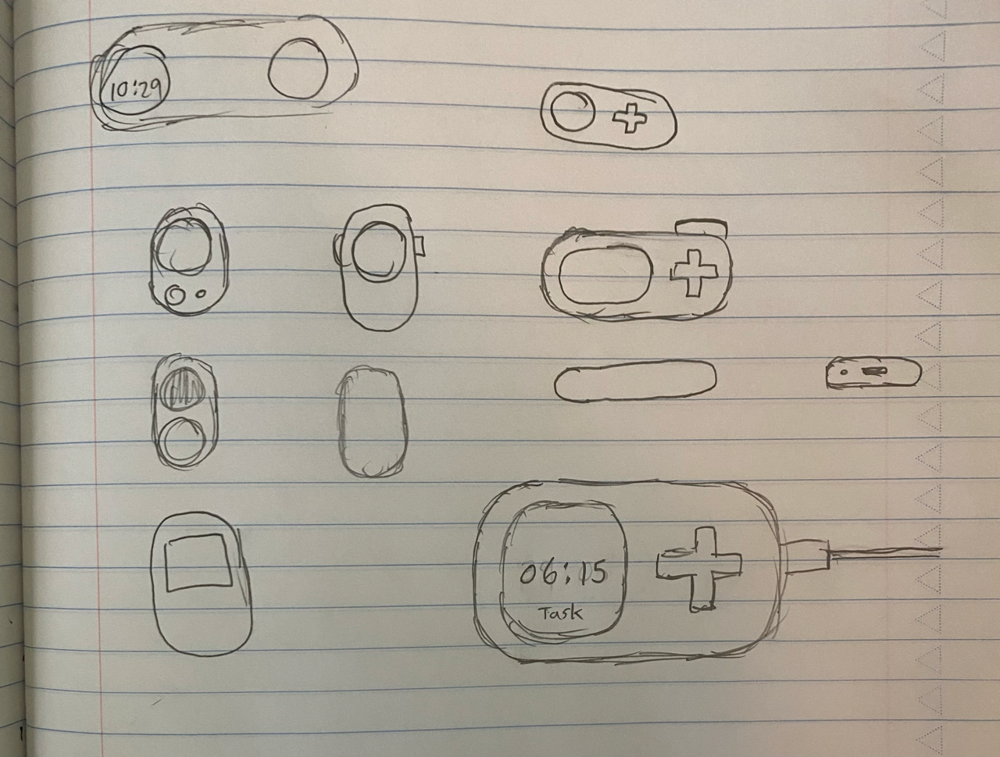

*If it wasn't obvious, the new design is at the bottom right*

**Total time spent: 0.5h**

## June 16th: Shopping for a Redesign

Was a slower day, but I did a few important things today. First, I decided on a pill shaped footprint for Clook. I also found some new candidates (again...) for parts.

First up - the battery. Because I no longer have to deal with a circle, I can get a bigger battery that will fit better. I ended up going for this [1500 mAh battery](https://www.amazon.com/Qimoo-Battery-Rechargeable-Connector-Electronic/dp/B0CNLPZHKW?cv_ct_cx=lipo+battery+3.7v+1100+mAh&sbo=RZvfv//HxDF+O5021pAnSA%3D%3D&sr=1-1-6024b2a3-78e4-4fed-8fed-e1613be3bcce-spons&sp_csd=d2lkZ2V0TmFtZT1zcF9zZWFyY2hfdGhlbWF0aWM) that I found on Amazon. Compared to the last battery, it fits the enclosure so much better.

Next up - the display. I've decided once again to switch to an OLED, because of its better power efficiency with dark UIs compared to LCDs. [This OLED](https://www.mouser.com/ProductDetail/Newhaven-Display/NHD-1.8-160128UBC3?qs=2wMNvWM5ZX7EWoZh6grmVQ%3D%3D) is big enough, and it also conveniently has screw holes for mounting (solving a problem before it even happens!).

Finally, I made a rough mockup to see how everything would fit in CAD. Check it out below!

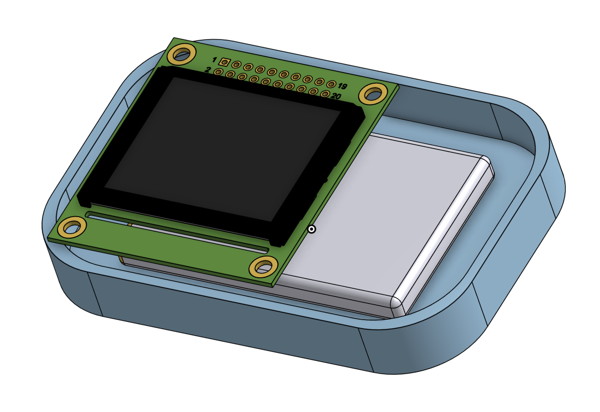

**Total time spent: 0.5h**

## June 18th: Schematic and Charging

Today, I focused my attention on the schematic. Because I am no longer using that old LCD display, I can ditch the voltage regulators (minus the 3.3V one) that were needed to power it, since the OLED I found can take 3.3V, along with the XIAO. 

I added the new display to the schematic, which was a lot easier than the last one due to a better and clearer datasheet (and only one voltage input source).

The one thing that I think the schematic needs now is a TP4056. The remainder of the time I spent on the project was focused on learning about how the module works (since it has everything already integrated into it), and whether it would be a viable choice (which I think it will be). Shopped around a little bit, and [this](https://www.aliexpress.us/item/3256805951432581.html?utparam-url=scene:search%7Cquery_from:pc_back_same_best&algo_pvid=fae49043-474c-4025-92fb-6a591d335cf3&algo_exp_id=fae49043-474c-4025-92fb-6a591d335cf3&pdp_ext_f=%7B%22order%22:%221312%22%7D&pdp_npi=4@dis!USD!1.72!1.52!!!12.26!10.83!@2103273e17502938795214583e2271!12000037875684558!sea!US!0!ABX&gatewayAdapt=4itemAdapt) TP4056 model from AliExpress seems to be promising.

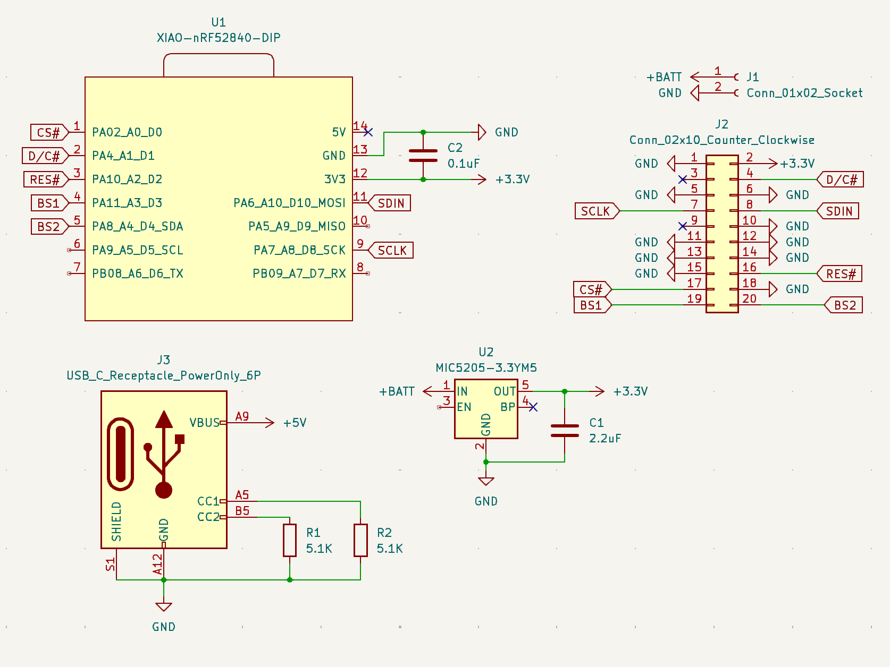

**Total time spent: 0.75h**

## June 20th: Charging Up the Schematic

It's been about 2 days, and since then, I have been pondering the TP4056. It would be nice to use, but unfortunately, the devil is always in the details.

First, (the big dealbreaker): I can't use Clook while it's charging with the TP4056. This is because it lacks Power Path Management, or basically the ability to dynamically charge and power the device at the same time.

Secondly, I've heard about fake TP4056's being sold online, with cheaper replacement ICs after more digging. Power is very important to this whole project, so I don't want to take risks anymore with the AliExpress page suspiciously blurring the markings on what should be the TP4056 chip.\

Finally, the module wouldn't fit that well into the case. Also, the LED placement would be very awkward for charging indication.

The solution - [BQ24074RGTR](https://www.mouser.com/ProductDetail/Texas-Instruments/BQ24074RGTR?qs=ZV/xhq4oszp2Nll7fIx5wg%3D%3D) from Texas Instruments. Main reason why I chose it was because it has Power Path Management, so Clook can run and track time while plugged in on a desk for example.

Did a bunch of reading into the datasheet, and I have now updated my schematic to include battery charging (hopefully)!

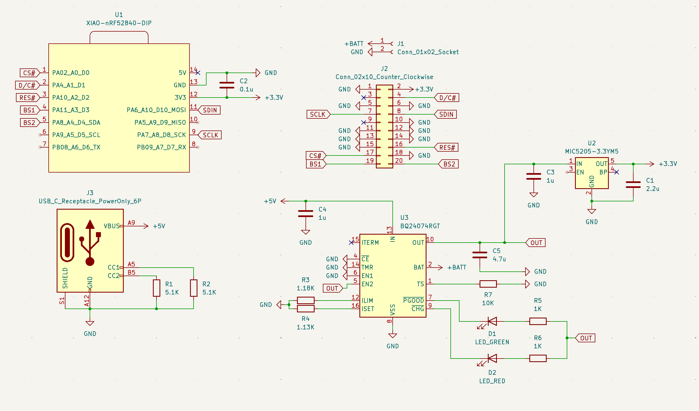

**Total time spent: 1.5h**

## June 21st: BOM Begins!

Today, I added a couple of the final touches on the schematic with the addition of 4 buttons (marked as push switches). We ran out of GPIO on the XIAO now, but we can get more if we use the Plus board if we need.

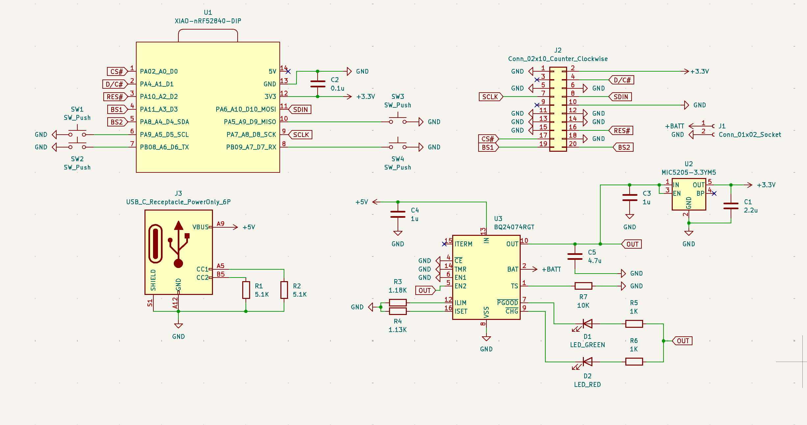

After that, I primarily worked on developing the BOM, just so I can get a current sense of how much this whole thing will cost me. THe price of all the components (not the PCB, or PCBA) is looking to be around $60, which gives me confidence that the project will be under $150.

I'm currently trying to get as much stuff on the PCB as possible from LCSC, so that PCBA with JLCPCB works nicely. However, if that gets too expensive, I'll probably have to switch to DigiKey or Mouser for PCB components.

Here's what the BOM looks like (not adding it to the repo yet because I don't want to have to download and upload a updated version every time I modify it).

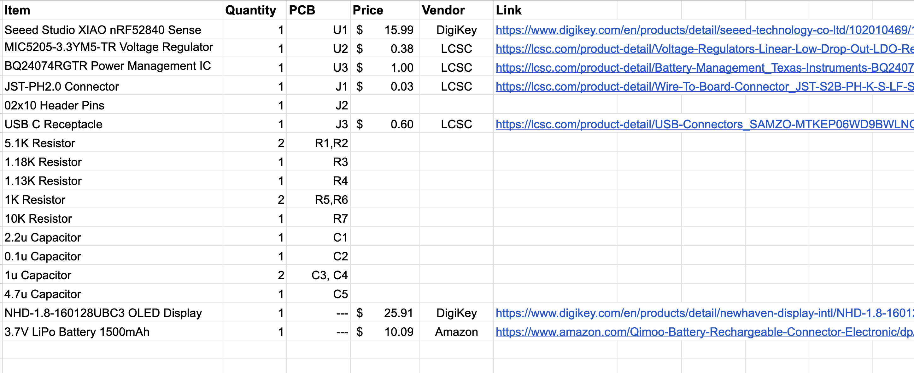

## June 23rd: Schematic (Basically) Done

Got a lot done today. First off, I added an ambient light sensor to the schematic, along with the XIAO nRF52840 Sense Plus to accomodate the extra GPIO. I added an extra button, to act as a pause/play for the stopwatch mechanism of Clook (and stop if you hold it). I even consolidated the two LEDs for charging status into one.

To add on top, I went and found footprints for everything. So, now I have a (very very) rough draft of the PCB. You can see it and the current schematic at the end.

The only thing I am pondering is adding a Linear Resonance Actuator (LRA) or some sort of device that can achieve vibrations, so you can know whether Clook is running low on battery for example while it's in your pocket, or whether you canceled the tracking for a task.

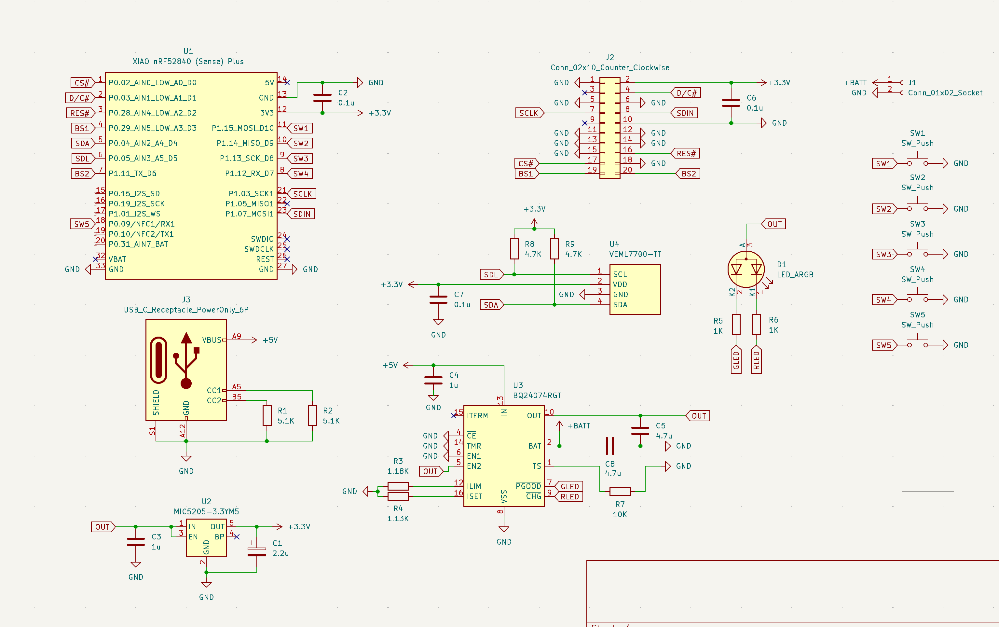

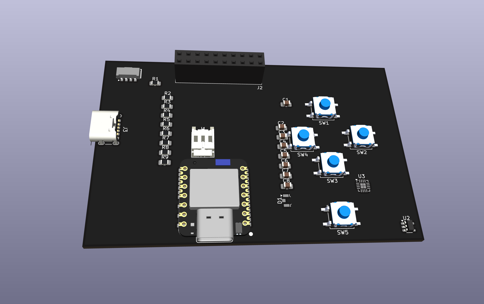

**Total time spent: 4h**

## June 24th: Ready to Rumble!

I added the LRA/vibration motor today. Also had to add another TI IC, the DRV2605LDGS, in order to be able to control it. With that addition, I'm practically out of GPIO spots on the XIAO, so the schematic is basically done now. I don't really know what else to add at the moment also.

So I started (for real) to work on the PCB. Turns out that working with curves is very annoying (since my enclosure is rounded a lot). This resulted in a little bit of fun placing components (not precisely though) and me beginning to route. 

It's all starting to come together.

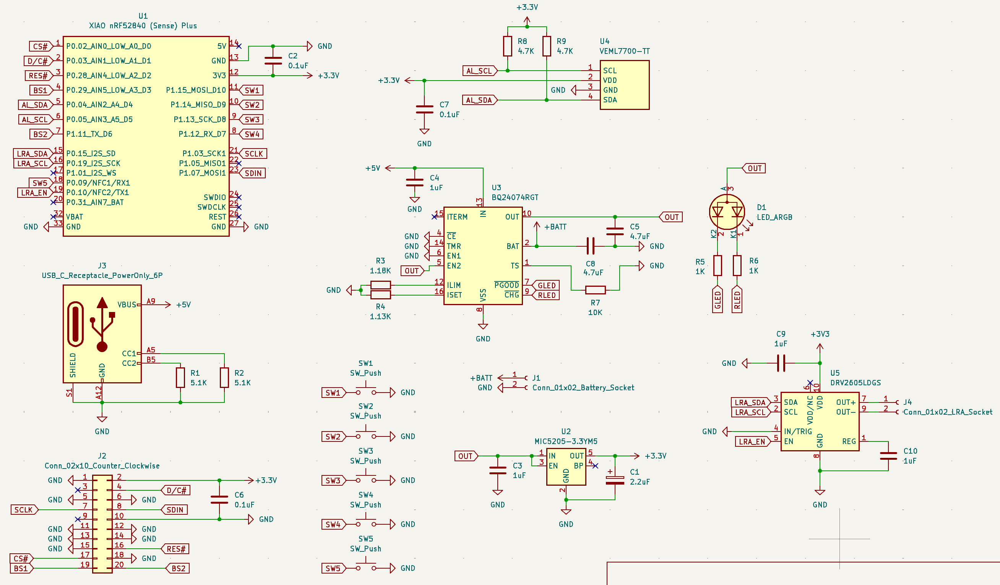

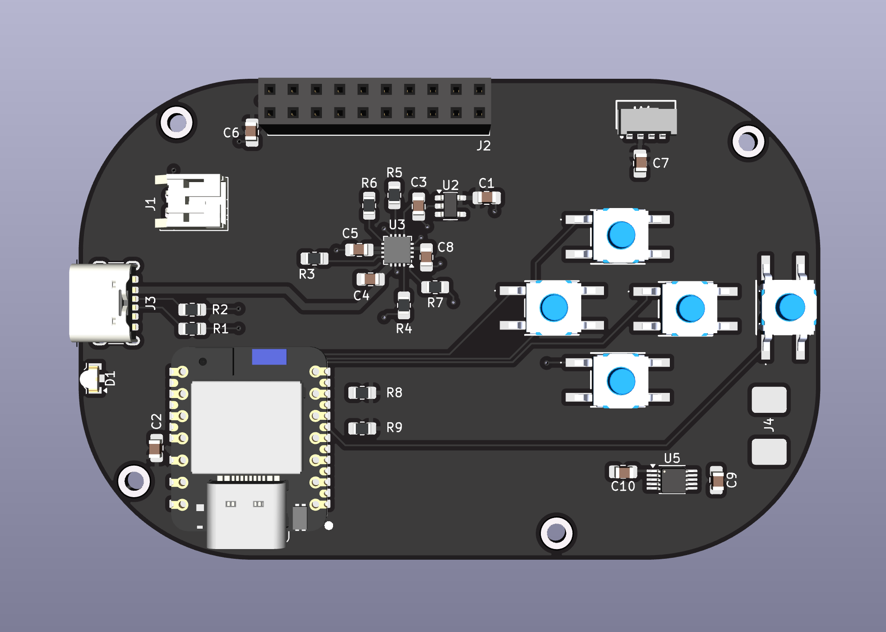

Took a break, but I got back at it. This time though, I focused on the CAD just so I could know with certainty where things like the buttons should go on the PCB. As you can see, I played a fair bit with the placement, and even started to experiment with rendering in Autodesk Fusion (360). Still undecided on the coloring for the buttons but I prefer the vertical layout.

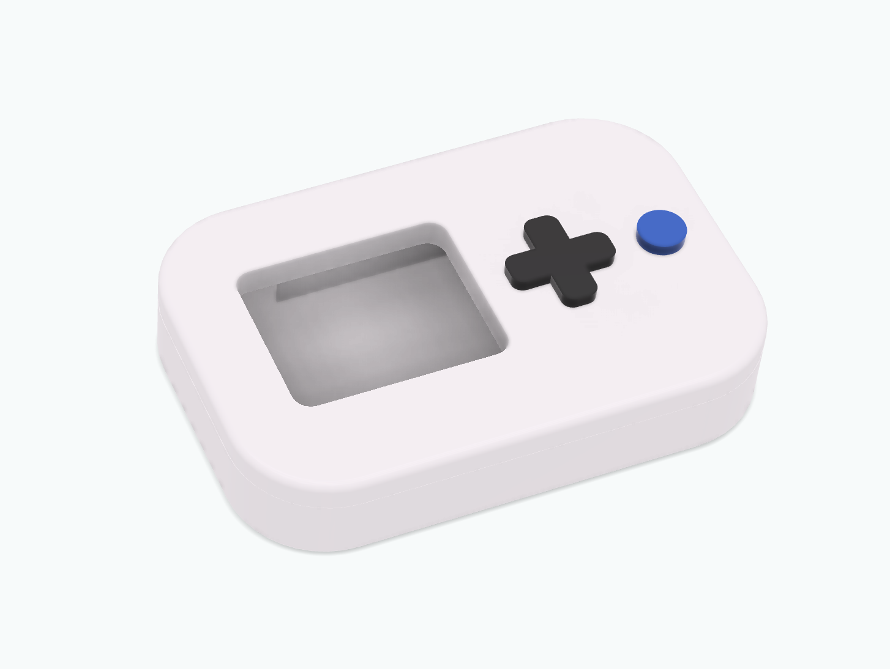
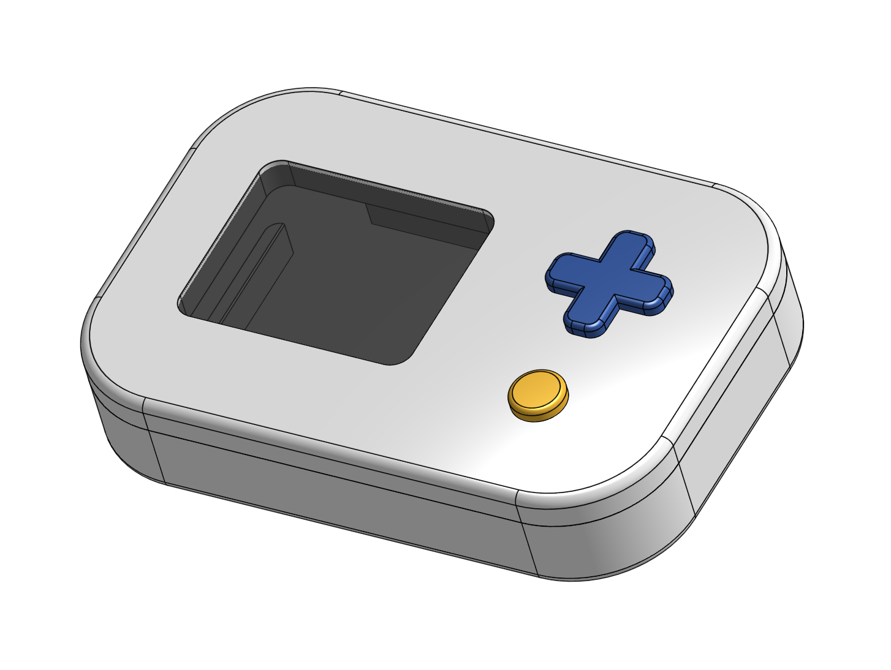

**Total time spent: 4.25h**

## June 26th: PCB Routing

Exactly what the title says. I literally spent hours trying to route signals from all over the board to the XIAO, fixing the board shape, getting smaller buttons, figuring out where to put the battery connector (and the (vibration motor)[https://www.digikey.com/en/products/detail/vybronics-inc/VG1040003D/10285886]), and more. All while trying to get Design Rule Checker down to 0 errors from 30 intially.

Loads of vias later, I routed everything, and I'm pretty proud of the PCB. I think it is very close to being finished, but I'll have to see how it fits in CAD before calling it done.

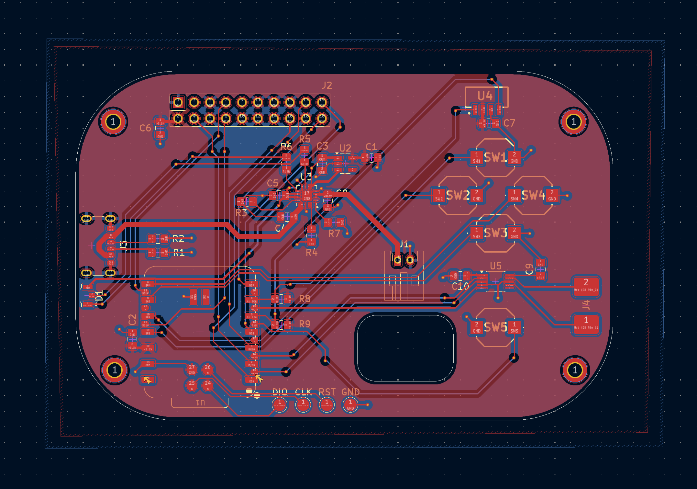

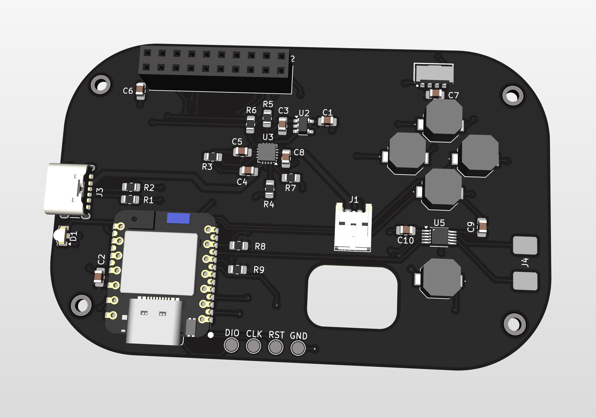

**Total time spent: 3h**

## June 27th: Integration

Did some more PCB polishing today, with a main focus on the look of the board. I just learned of how easy it is to use custom images on silkscreen in KiCad, so I played around with the idea of adding a QR Code to my GitHub account on the back of the board. Aside from that though, I finally faced my fears and imported the full PCB STEP file into the CAD, and realized how much tweaking and re-importing I would have to do.

Because of this, I realized that I still needed screw holes in the PCB for the display, my PCB corners were too rounded, and the connector hole was overlapping with the battery. Not great.

Eventually though I pushed through and now the PCB design looks like this:

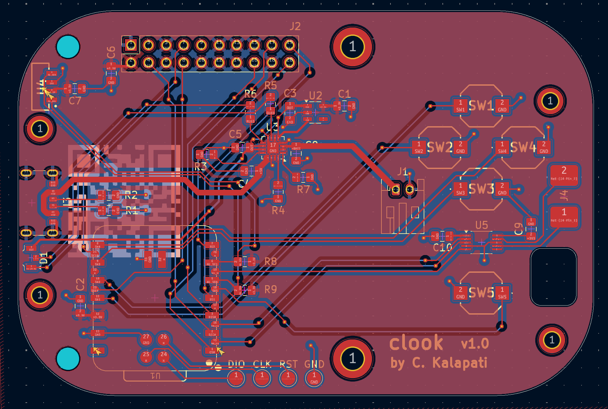

**Total time spent: 2h**

## June 29th: Charging Port

Kept going at integrating the PCB into CAD. This time though, I especially focused on the placement of the charging port. Originally, when I first imported the PCB, it was positioned more towards the top. However, after finding a [new battery](https://www.amazon.com/Rechargeable-Integrated-Protection-Development-Electronic/dp/B0DSMRNHSP?sr=8-6) that is thinner online, I have managed to get the USB C charging port that I made a cutout for today to be more vertically centered. See for yourself.

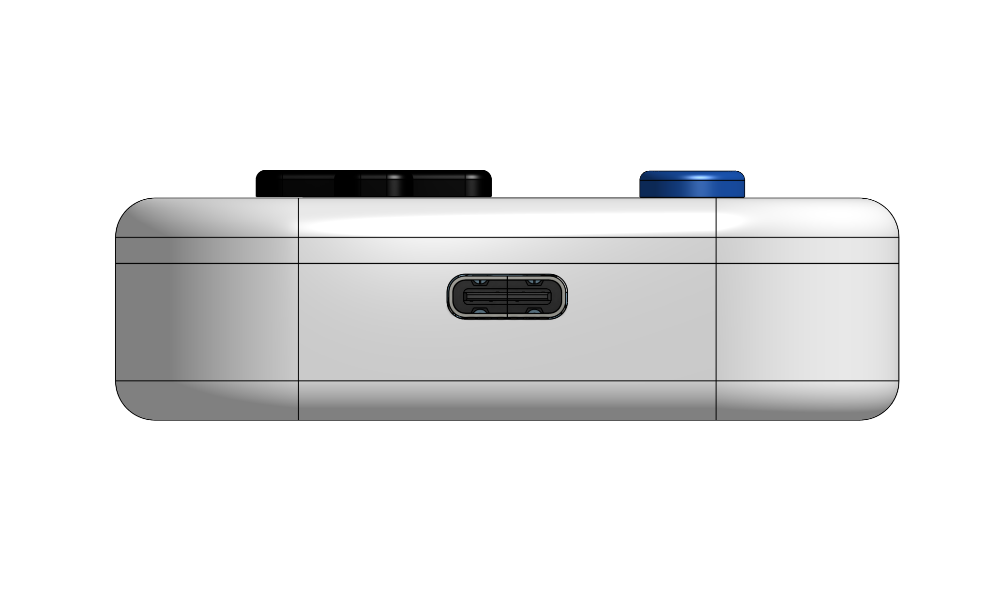

**Total time spent: 1.5h**
