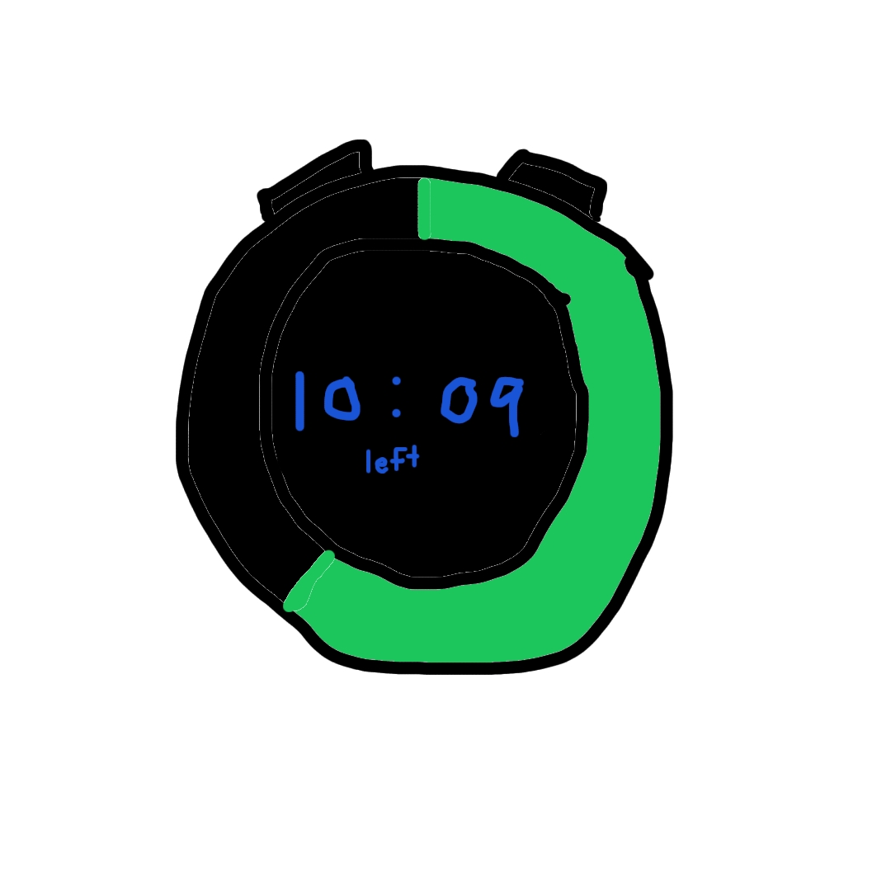
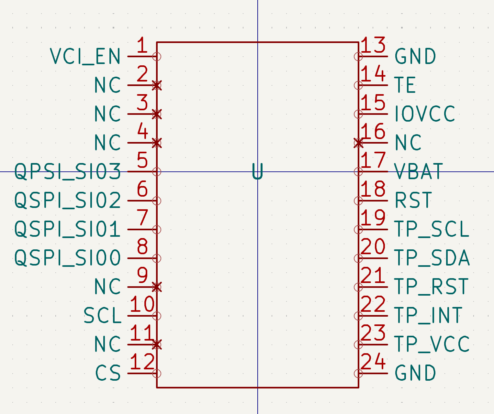
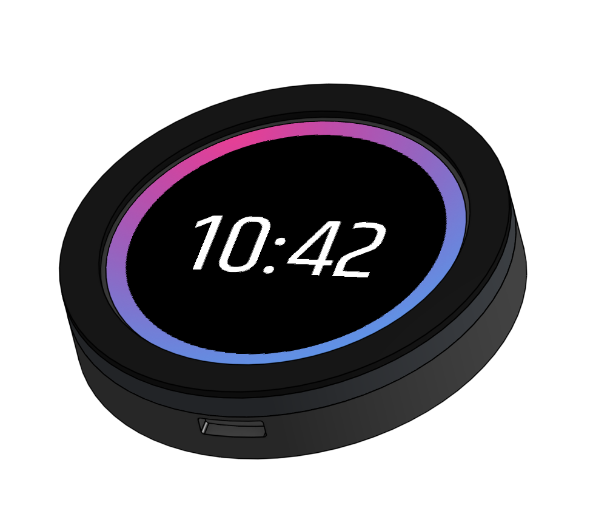
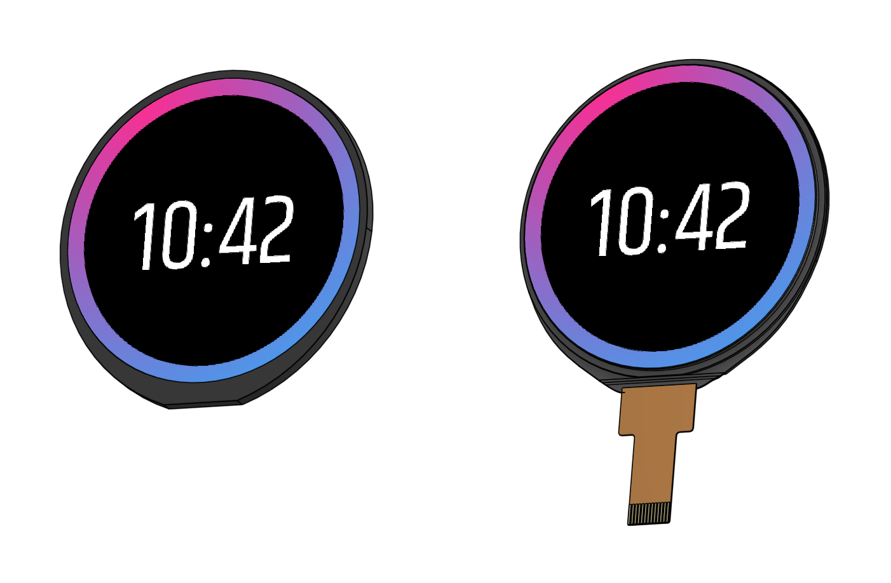
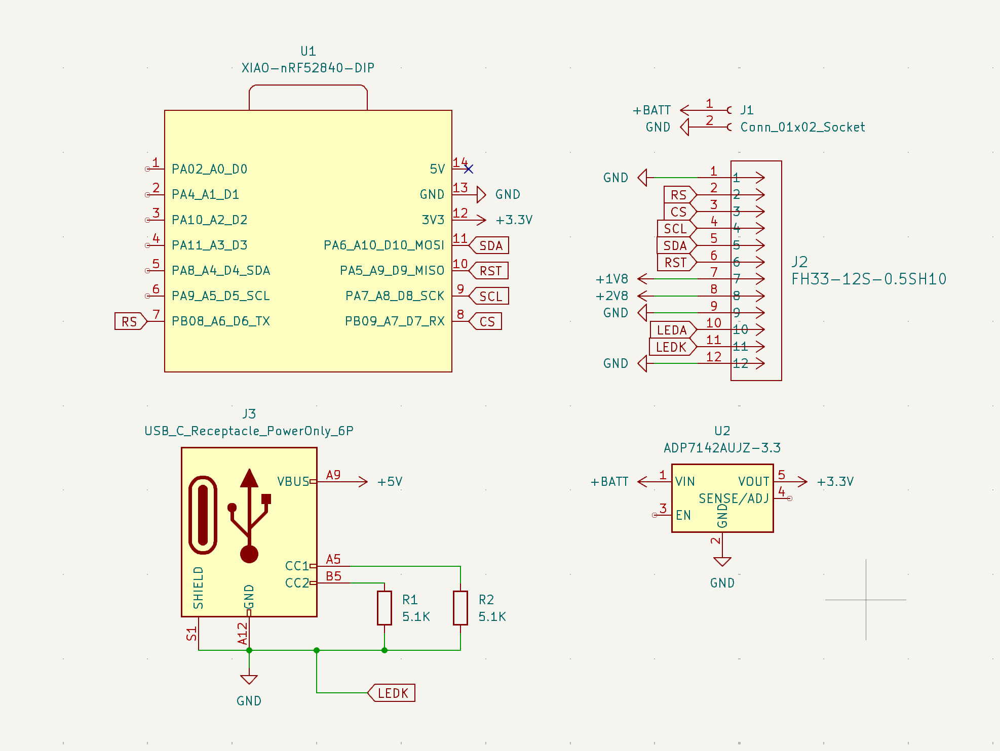
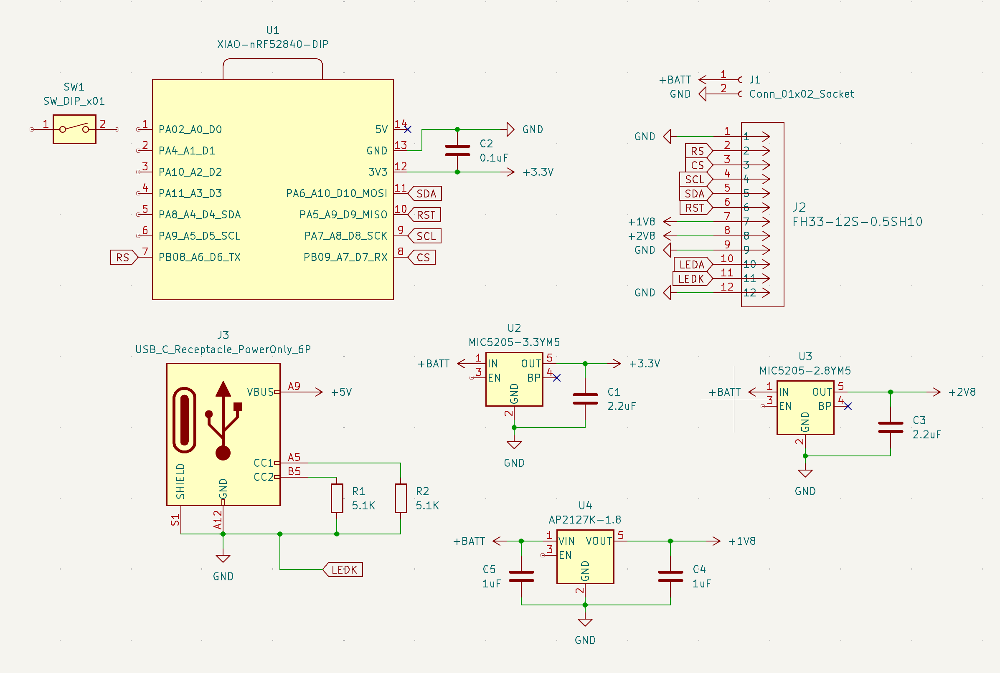
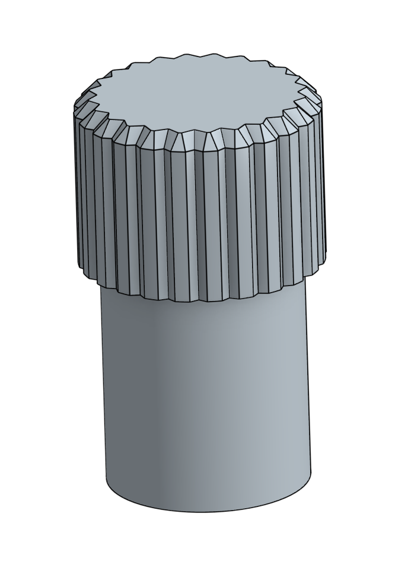

**Total time spent on project: 11.5h**

## June 4th: Start!

After some thinking for almost an hour, I decided to make my own timer/stopwatch thing. Calling it "Clook" because it sounds similar to "clock", but in a fun and unique way. 

Whipped out an online painting tool to flesh out my intial idea. Features I want to have are:
- USB C charging
- LED ring to show timer status and display things
- Screen to show exact time left (maybe touch screen?)
- Physical buttons to also interact with the device

You can see my very rough rendering below.

**Total time spent: 1.5h**

## June 7th: Finding the Display

Today was spent primarily trying to figure out what display I would use for the project. After thoroughly checking DigiKey, Mouser, and LCSC for a small circular OLED display, I decided (tentatively) to just use [this](https://www.alibaba.com/product-detail/1-5-Inch-466-466-16_1601271796179.html) display from Alibaba. Because it was from Alibaba, and the product description had no datasheet whatsoever, I had to track it down from the vendor website. Eventually though, I was able to make a symbol for the display in KiCad.

The one thing that is scaring me though is the shipping time. If I were to order right now, the screen would come earliest July 11th...

Don't know yet though if that will be a dealbreaker. Another display that I might pivot to is an [LCD](https://www.mouser.com/ProductDetail/Microtips-Technology/AWD-360360T18N01?qs=sGAEpiMZZMt7dcPGmvnkBgpwamjCGwcHVYYbZzFyeqeK65tjxJno9g%3D%3D) from Mouser, simply because it's around the same price with shipping, and it can come significantly quicker. Its datasheet is also easier to understand and simpler overall.

**Total time spent: 2h**

## June 11th: Part Hunting and CADding

Did a lot today. My main focus was on trying to get a rough idea of the footprint of the entire device, and to start to look for parts that can feasibly fit the footprint (mainly the battery).

*Side note: I decided after all to abandon the Alibaba OLED display from the last journal entry in favor of the LCD mainly because of shipping. So much for that KiCad schematic..*

After scouring the Internet, and modifying my CAD design, I decided to use this [LiPo Battery](https://www.amazon.com/AKZYTUE-Battery-Rechargeable-Lithium-Connector/dp/B07TS8LTH7) that I found on Amazon to power the project. It has a modest 710 mAh capacity, which should hopefully be enough to power this device for maybe several hours, and last some battery charging cycles.

Another thing that I researched today was including an ambient light sensor to figure out if the display needs to be on fully or if it can be dimmed a lot. My plan right now is to include it somewhere on the front, but we shall see if that is possible once I begin making the PCB.

Last thing - I also came up with a better looking UI that will be a decal in CAD for the LCD in Figma. You can see it on the rough CAD assembly I made today below.

(I kept working after writing that entry)

Was too tired to finish that journal entry for Jun. 11th, but I worked a little bit more after the CAD session on trying to find a footprint for the LCD screen. It required a Hirose FH33-12S-0.5SH connector, but I could not find the footprint on the Hirose website, on KiCad, and even on Mouser. It wasn't until I went to DigiKey under some tab on the product page that I found it.

Hopefully that actually works, if not I might be screwed.

**Total time spent: 3h**

## June 12th: Schematic Start

Woke up this morning to an email from Mouser. My CAD request for the LCD screen that I made earlier had gone through, so now the 30 minutes that I spent yesterday on the LCD screen CAD, trying to find the right dimensions from the datasheet, is (basically) irrelevant now. You can see how close I did get though in the picture below:

Also started working on my schematic for the project (see below). This required *a lot* of research. To show how much, here's all the things that I learned about today:

- SPI vs I2C communication for LCD (and which one my screen used)
- Voltage regulators (linear vs switching)
- USB C specifications and standard
- Bluetooth vs BLE
- nRF52840 chip (which has BLE)

Going off of that last bullet point, I have also tentatively decided to use the Seeed Studio XIAO nRF52840 to run the whole project. Still researching about voltage regulators and how they work (trying to learn if I should go fixed or adjustable).

Overall productive day.

**Total time spent: 3h**

## June 13th: Decoupling Capacitors

Shorter day today, primarily because I finished up all the loose ends from voltage regulators that I dove into yesterday. Did some poking around online to learn about decoupling or bypass capacitors, and I realized that I probably should have some in my schematic (so I added them). All of the voltages for the LCD screen in the schematic should (fingers crossed) be good now.

Additionally, I also started to do some more research on the XIAO nRF52840 and its capabilities, and I think I might have to pivot away from it due to it supporting only one SPI interface. Its beefier brother, the XIAO nRF52840 Sense Plus, is looking like a better option now because of the 2 SPI interfaces that it provides.

The reason why I think I want to provide another SPI interface is oriented around what I want this device to do. After thinking for a week, I've decided to go all in on the idea of "a stopwatch that remembers". So sometime soon I'm going to try to add a MicroSD card slot so there is a way to "remember" what was tracked and when.

Here's what the schematic looked like after today's work:

**Total time spent: 1.5h**

## June 14: Small things

Didn't get to do as much today (weekend), but I still got some minor stuff done.

First off, I decided that I wanted to make this stopwatch resemble more of a mechanical stopwatch (example [here](https://www.marathonwatch.com/collections/mechanical-stopwatches/products/6-second-stopwatch-calibrated-yards)). So, I played around with the CAD and dimensions, and also looked for really tiny rotary encoders. It seems like I might have to make the watch thicker to account for rotary encoder on the "crown" of the stopwatch (most were at least 10mmx10mm), so we'll see how far I get with that.

I also made a prototype crown that I could maybe attach to a 6mm rotary encoder.

**Total time spent: 0.5h**